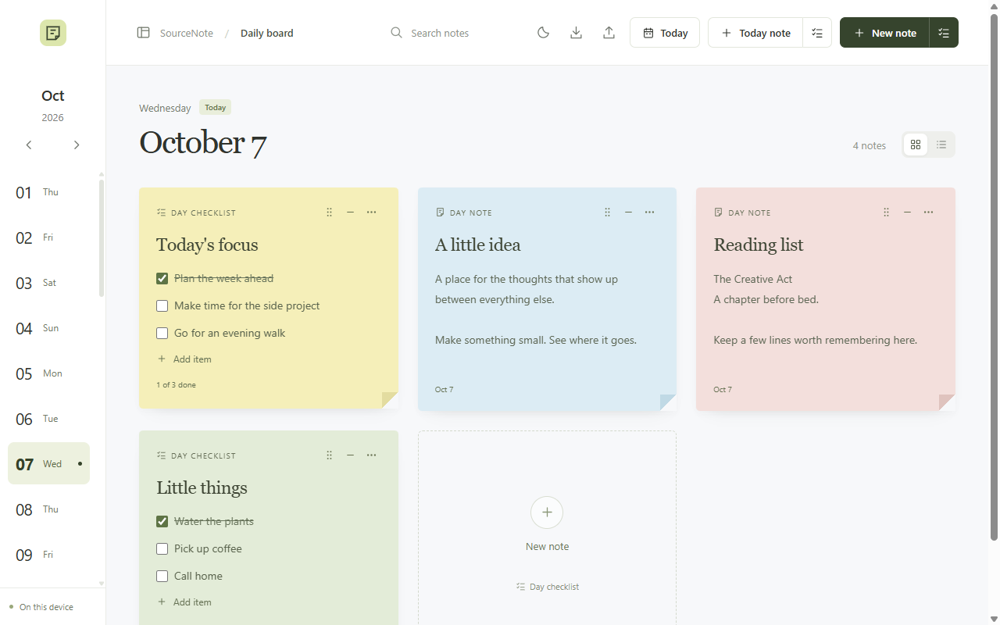
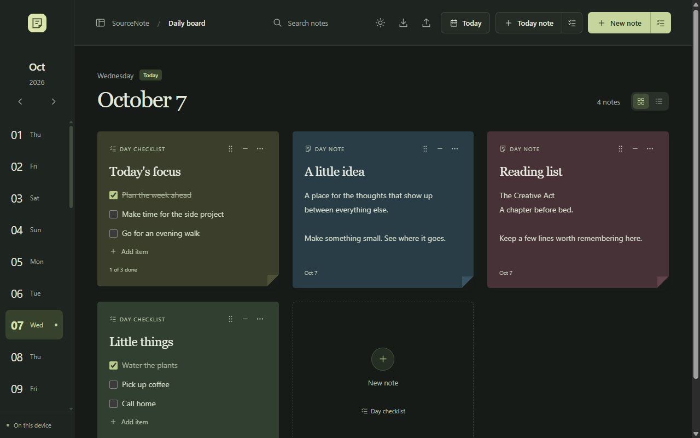

# SourceNote

A personal daily planner with sticky notes, checklists, and tasks assigned to dates. Built for Windows, with an English interface and light and dark themes.

[Download for Windows](https://github.com/AliNajafpour/SourceNote/releases/latest) · [Report an issue](https://github.com/AliNajafpour/SourceNote/issues)



## Install on Windows

1. Open the [latest release](https://github.com/AliNajafpour/SourceNote/releases/latest).
2. Under **Assets**, download **SourceNote-Windows.zip**.
3. Right-click the ZIP and choose **Extract All**.
4. Open the extracted folder and double-click **SourceNote.exe**.

Keep the `app` folder and DLL files beside `SourceNote.exe`. You can create a desktop shortcut to the executable. No installer, account, Node.js, or web server is needed to run the Windows app.

Requires **64-bit Windows 10 or 11**, [.NET Framework 4.8](https://dotnet.microsoft.com/en-us/download/dotnet-framework/net48), and [Microsoft Edge WebView2 Runtime](https://developer.microsoft.com/en-us/microsoft-edge/webview2/). If WebView2 is missing, install the **Evergreen Standalone Installer for x64**, then reopen SourceNote.

The executable is unsigned, so Windows may display a publisher warning. Release downloads include `SHA256SUMS.txt`; you can check a downloaded ZIP in PowerShell with `Get-FileHash .\SourceNote-Windows.zip -Algorithm SHA256`.

### Update

Close SourceNote, download the latest ZIP, and extract it into a new folder. Launch the new `SourceNote.exe` and update your shortcut. Your notes are stored separately from the app and remain available after updating. Export a backup before updating.

## How to use

### Choose a day

Click a date in the left sidebar. Use the arrows above it to change months, or **Today** to return to the current day. Dots indicate dates with notes or scheduled tasks.

### Add notes and checklists

Each creation button has two sections: the main section creates a note; the smaller checklist icon creates a checklist.

| Button | What it creates |
| --- | --- |
| **New note** | A general note, visible on every day |
| Checklist icon beside **New note** | A general checklist, visible on every day |
| **Today note** / **Day note** | A note belonging to the selected date |
| Checklist icon beside **Today note** / **Day note** | A checklist belonging to the selected date |

Click a note's title or body to edit it. Changes save automatically. In a checklist, click **Add item** or press **Enter** while editing an item to add another; **Shift+Enter** inserts a line break. Tick a checkbox to complete a task.

### Schedule individual tasks

Click the calendar beside a checklist item and choose a date. You can also drag an item's grip onto a date in the sidebar.

That task appears in **Scheduled tasks** on its assigned date, even when its original checklist belongs to another day. Completing it updates the original item too. Click the checklist name under a scheduled task to open its source. Use the calendar control to change the date or **Clear date** to remove it.

### Organize the board

- Use the minus button to minimize a note; the chevron restores it.
- Drag a note's grip to reorder cards, or use **Move earlier** / **Move later** in its **…** menu.
- The **…** menu also changes color, duplicates notes, and deletes them. **Undo** restores the most recently deleted note during the current session.
- Search filters the selected day's board, including general notes and scheduled tasks.
- Use the grid/list buttons to change the layout.
- Use the moon/sun button to switch themes. The first launch follows your system theme; your choice is saved, including the Windows title bar.
- **Alt+N** creates a general note. **Esc** closes open note menus and dismisses the status message.



## Saving and backups

The Windows app works offline. Notes stay on your device; there is no account or cloud sync.

- **Download icon:** export all notes and scheduled task dates to a JSON backup.
- **Upload icon in the Windows app:** import a SourceNote JSON backup. Import replaces the current notes after confirmation. The app validates the file and keeps a copy of the previous notes before importing.
- Windows data: `%LOCALAPPDATA%\SourceNote\WebView2`.
- Copies saved before imports: `%LOCALAPPDATA%\SourceNote\Backups`.

Keep exported backups somewhere safe. Deleting the Windows data folder removes the app's local notes. Theme preferences are separate from note backups.

To move notes from the browser version, export them there and import the JSON into the Windows app. Each browser origin/profile and the Windows app have separate storage.

## Run the browser version

Install [Node.js](https://nodejs.org/) **22 or newer**, then:

```sh
git clone https://github.com/AliNajafpour/SourceNote.git
cd SourceNote
npm start
```

Open [http://127.0.0.1:5180](http://127.0.0.1:5180). No npm dependencies need installing. Keep the server running while using the browser version.

Browser notes save in that browser's local storage. Clearing site data removes them. The browser can export backups; backup import is available in the Windows app. The first launch includes four editable example notes.

## Build and test

The interface uses HTML, CSS, and JavaScript. The Windows host uses WinForms and Microsoft Edge WebView2.

```sh
npm test
```

On 64-bit Windows with .NET Framework 4.8 and Node.js 22 or newer:

```sh
npm run build:windows
npm run test:windows
```

The first build downloads Microsoft's pinned WebView2 SDK from NuGet. Output is `dist/SourceNote/SourceNote.exe` and `dist/SourceNote-Windows.zip`. The native test requires the WebView2 Runtime, launches a temporary app window, and uses an isolated test profile. It checks startup, scheduling, completion sync, storage, backup import, and theme persistence.

GitHub Actions runs the model checks and builds the Windows ZIP on pushes and pull requests. Pushing a `v*` tag also publishes the ZIP and its SHA-256 checksum as a GitHub release. The native UI check runs locally; CI builds do not run it.

## Troubleshooting

| Problem | Fix |
| --- | --- |
| App reports a missing WebView2 Runtime | Install the x64 Evergreen runtime linked above. |
| App will not open or reports missing DLLs | Extract the entire ZIP and keep all bundled files together. |
| Notes are missing after switching versions | Browser and Windows storage are separate. Export from the original version and import into Windows. |
| Changes are not saved | Use the download button to export a backup, then check available disk space and access to the data folder. |
| Browser server reports the port is in use | Close the previous SourceNote server before running `npm start` again. |

Include your Windows version and the error message when [reporting a problem](https://github.com/AliNajafpour/SourceNote/issues).
